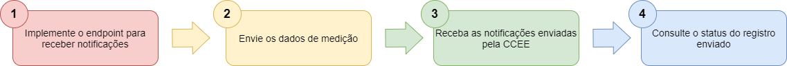
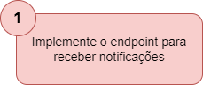
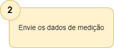
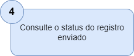

# Envio e consulta de medições através da Plataforma de Integração
Ao realizar a integração entre sua aplicação e a CCEE através da Plataforma de Integração, o agente pode:

- Enviar dados de medição
- Consultar as medições
- Obter informações de um ponto de medição. 

## O que fazer para enviar dados de medições?

 
### Implemente o endpoint para receber notificações

Implemente uma interface RestAPI que irá receber o retorno da situação da coleta assim que a mesma for admitida ou recusada pela CCEE.

Os detalhes da API e exemplos de implementação, estão disponiveis no manual [Retornar Situação Coleta Medição](https://www.ccee.org.br/documents/80415/919484/Manual%20do%20Usu%C3%A1rio%20-%20Retornar%20Situacao%20Coleta%20Medicao.pdf/e0f36c42-4e4f-1d51-f283-85344ee40e5c).
 
--- 
 
### Envie os dados de medição

Utilize o serviço *InformarColetaMedicao* para envio das coletas de medições através da Plataforma de Integração da CCEE.

[Clique aqui](https://documenter.getpostman.com/view/12351215/TVCdzTxD#1bdbb540-1ee0-4ae8-a02e-23a52bf9aa18) para ver exemplos de consulta utilizando a ferramenta Postman em seu  navegador.
    
Os campos de entrada e saída do serviço podem ser consultados no [manual de utilização](https://www.ccee.org.br/documents/80415/919484/Manual%20do%20Usu%C3%A1rio%20-%20Informar%20Coleta%20Medicao.pdf/e1239897-7981-b1ad-ca68-671645fbebf1) desse serviço. 

> Clique no botão abaixo e abra a configuração direto no Postman instalado em seu computador com os serviços da Plataforma de Integração, incluindo o Informar Coleta Medição
>
> 

---

### Receba as notificações enviadas pela CCEE

A Plataforma de Integração da CCEE realizará apenas uma tentativa de requisição ao serviço exposto, no passo 1, e disponibilizado para receber a situação da coleta de medição enviada via Plataforma de Integração. 

Os detalhes da API e exemplos de implementação, estão disponiveis no manual [Retornar Situação Coleta Medição](https://www.ccee.org.br/documents/80415/919484/Manual%20do%20Usu%C3%A1rio%20-%20Retornar%20Situacao%20Coleta%20Medicao.pdf/e0f36c42-4e4f-1d51-f283-85344ee40e5c).

---

### Consulte o status do registro enviado

Se desejado, é possível consultar o status de notificações enviadas. Á consulta está disponível através do serviço *Obter Situação Coleta Medição*.

[Clique aqui](https://documenter.getpostman.com/view/12351215/TVCdzTxD#146bf629-a415-4972-afe0-42e6e78c0021) para ver exemplos de consulta utilizando a ferramenta Postman em seu  navegador.

Os campos de entrada e saída do serviço podem ser consultados no [manual de utilização](https://www.ccee.org.br/documents/80415/919484/Manual%20do%20Usu%C3%A1rio%20-%20Obter%20Situacao%20Coleta%20Medicao.pdf/7736ea26-c9a6-a944-88f3-642a67c6cbd2) desse serviço. 

> Clique no botão abaixo e abra a configuração direto no Postman instalado em seu computador com os serviços da Plataforma de Integração, incluindo o Situação Coleta Medição
>
> 

## Como consultar os dados de medições ? 
Existem quatro formas de consultar as medidas registradas na CCEE através da Plataforma de Integração, são elas: 

- **Medida de 5 em 5 minutos** - permite a consulta de medidas consistidas em intervalos de 5 minutos.
    
    [Clique aqui](https://documenter.getpostman.com/view/12351215/TVCdzTxD#b19d7aac-5e54-4d4c-bdf6-3585d45463fc) para ver exemplos de consulta utilizando a ferramenta Postman em seu  navegador.
    
    Os campos de entrada e saída do serviço podem ser consultados no [manual de utilização](https://www.ccee.org.br/documents/80415/919484/ListarMedidaCincoMinutosBSv2.pdf/ef5c3678-4fe7-7216-eb34-af41a453d28b) desse serviço. 
    
    > Clique no botão abaixo e abra a configuração direto no Postman instalado em seu computador com os serviços da Plataforma de Integração, incluindo o Listar Medidas - 5 minutos
    >
    > 
    
- **Medida consolidada** - permite a consulta de medidas consolidadas. Esse serviço retorna através da Plataforma de Integração os mesmos dados do *relatorio de medidas consolidadas* no SCDE.

    [Clique aqui](https://documenter.getpostman.com/view/12351215/TVCdzTxD#b6f7bcb4-913b-48a7-8cdf-5889a6d20e67) para ver exemplos de consulta utilizando a ferramenta Postman em seu  navegador.
    
    Os campos de entrada e saída do serviço podem ser consultados no [manual de utilização](https://www.ccee.org.br/documents/80415/919484/ListarMedida.pdf/962fa85d-520c-adfa-09ae-b24ed6dfabbc) desse serviço. 
    
    > Clique no botão abaixo e abra a configuração direto no Postman instalado em seu computador com os serviços da Plataforma de Integração, incluindo o Listar Medidas consolidadas
    >
    > 
        
- **Medida faltante** - permite a consulta de períodos contendo dados faltantes.

    [Clique aqui](https://documenter.getpostman.com/view/12351215/TVCdzTxD#27878282-e723-4134-9962-c712ddc39560) para ver exemplos de consulta utilizando a ferramenta Postman em seu  navegador.
    
    Os campos de entrada e saída do serviço podem ser consultados no [manual de utilização](https://www.ccee.org.br/documents/80415/919484/ListarMedida.pdf/962fa85d-520c-adfa-09ae-b24ed6dfabbc) desse serviço. 
    
    > Clique no botão abaixo e abra a configuração direto no Postman instalado em seu computador com os serviços da Plataforma de Integração, incluindo o Listar Medidas faltantes
    >
    > 
        
- **Medida final** - permite a consulta de medidas finais. Esse serviço retorna através da Plataforma de Integração os mesmos dados do *relatorio origem de dados da coleta* no SCDE.

    [Clique aqui](https://documenter.getpostman.com/view/12351215/TVCdzTxD#951b4af2-aa45-4115-b201-5de96f4bab91) para ver exemplos de consulta utilizando a ferramenta Postman em seu  navegador.
    
    Os campos de entrada e saída do serviço podem ser consultados no [manual de utilização](https://www.ccee.org.br/documents/80415/919484/ListarMedida.pdf/962fa85d-520c-adfa-09ae-b24ed6dfabbc) desse serviço. 
    
    > Clique no botão abaixo e abra a configuração direto no Postman instalado em seu computador com os serviços da Plataforma de Integração, incluindo o Listar Medidas finais
    >
    > 
        
## Como consultar as informações do ponto de medição ? 
Você pode consultar as informações dos pontos de medição através dos serviços abaixo:

- **Listar pontos de medição por Agente** - esse serviço irá retornar a lista de pontos de medição associados ao perfil do agente informado.

    [Clique aqui](https://documenter.getpostman.com/view/12351215/TVCdzTxD#0f75b858-f471-4854-aa43-719ca5727df5) para ver exemplos de consulta utilizando a ferramenta Postman em seu  navegador.
    
    Os campos de entrada e saída do serviço podem ser consultados no [manual de utilização](https://www.ccee.org.br/documents/80415/919484/ListarPontoMedicaoBSv2.pdf/eeeababc-8d3b-4a20-b484-4927d7e32450) desse serviço. 
    
    > Clique no botão abaixo e abra a configuração direto no Postman instalado em seu computador com os serviços da Plataforma de Integração, incluindo o Listar Ponto Medicao
    >
    > 
    
- **Obter Dados do Ponto de Medição** - caso queira saber mais informações de um ponto de medição especifico, esse serviço irá retornar todos os dados cadastrais do ponto de medição informado.

    [Clique aqui](https://documenter.getpostman.com/view/12351215/TVCdzTxD#874a60d9-aa95-453f-998a-e56cbccc2b08) para ver exemplos de consulta utilizando a ferramenta Postman em seu  navegador.
    
	Os campos de entrada e saída do serviço podem ser consultados no [manual de utilização](https://www.ccee.org.br/documents/80415/919484/ObterPontoMedicaoBSv2.pdf/54818657-9bf7-b15f-c98d-ebca9fb2f9dd) desse serviço.
	
	> Clique no botão abaixo e abra a configuração direto no Postman instalado em seu computador com os serviços da Plataforma de Integração, incluindo o Obter Ponto Medicao
    >
    > 
